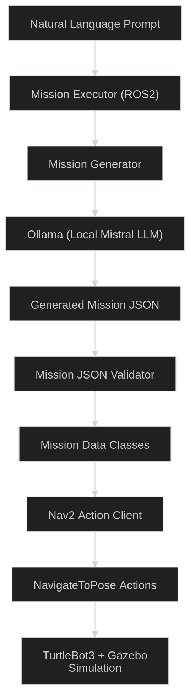
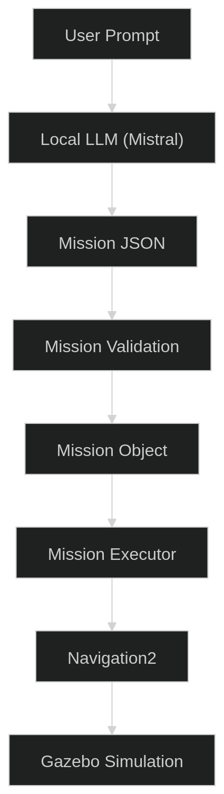

# Omokai GroundBot – LLM Powered Mission Executor

> ROS2 Humble • Nav2 • Gazebo • TurtleBot3 • Ollama • Mistral 7B

A complete end-to-end robotics pipeline that converts natural language instructions into deterministic robot navigation missions using a locally hosted Large Language Model (LLM).

---

# Core Task

This project implements the **Core Task** described in the Omokai Robotics Engineering Take-Home Assignment.

The objective is to build a complete robotics pipeline where:

```
Prompt
    ↓
LLM
    ↓
Validated Mission JSON
    ↓
Deterministic Executor
    ↓
Robot Simulator
```

The system allows an operator to issue natural language commands such as:

> **"Patrol the warehouse twice."**

The command is interpreted by a locally hosted LLM (Mistral running through Ollama), converted into a validated JSON mission, and executed deterministically using ROS2 Navigation2 inside a TurtleBot3 Gazebo simulation.

The LLM is **never placed inside the control loop**. Its sole responsibility is mission planning. All robot control is performed by a deterministic executor.

---

# Overview

This project demonstrates a modular architecture for autonomous mobile robots.

Instead of directly controlling the robot, the LLM generates a structured mission plan which is validated before execution.

The overall workflow is:

1. Receive a natural language instruction.
2. Send the instruction to a locally hosted LLM.
3. Generate a structured JSON mission.
4. Validate the generated JSON.
5. Convert the JSON into ROS2 mission objects.
6. Execute the mission using Nav2.
7. Navigate the TurtleBot3 inside Gazebo.

The project intentionally separates **mission planning** from **robot execution**, making the system deterministic, auditable, and suitable for future extensions.

---

# System Architecture


<p align="center">
  
</p>


---

# Execution Pipeline

<p align="center">
  
</p>


---

# Repository Structure

```
omakai-groundbot/

├── config/
│
├── missions/
│   └── warehouse_loop.json
│
├── ros2_ws/
│   ├── src/
│   │
│   └── omokai_executor/
│       ├── executor.py
│       ├── mission.py
│       ├── mission_loader.py
│       ├── mission_generator.py
│       ├── nav_client.py
│       │
│       ├── llm/
│       │   ├── ollama_client.py
│       │   ├── parser.py
│       │   ├── prompt.py
│       │   └── __init__.py
│       │
│       ├── launch/
│       │   └── mission_executor.launch.py
│       │
│       ├── package.xml
│       └── setup.py
│
└── README.md
```

---

# Features

## Robotics

- ROS2 Humble
- TurtleBot3 Burger
- Gazebo Classic
- Navigation2 (Nav2)
- Deterministic waypoint execution

---

## AI

- Local LLM using Ollama
- Mistral 7B model
- Natural language mission planning
- Structured JSON mission generation
- Prompt engineering
- Local inference (no cloud APIs)

---

## Mission Execution

- Multi-waypoint missions
- Multi-lap patrol missions
- Mission validation
- JSON schema validation
- Deterministic execution
- Modular architecture

---

# Technologies Used

| Technology | Purpose |
|------------|---------|
| ROS2 Humble | Robot middleware |
| Navigation2 | Autonomous navigation |
| Gazebo Classic | Robot simulation |
| TurtleBot3 | Mobile robot platform |
| Python | Mission execution |
| Ollama | Local LLM inference |
| Mistral 7B | Natural language understanding |
| JSON | Mission representation |

---

# Design Principles

The implementation follows four core principles:

### 1. Separation of Planning and Control

The LLM is responsible only for generating a mission.

It never sends velocity commands or directly controls the robot.

---

### 2. Deterministic Execution

Every validated mission always produces identical robot behaviour.

This makes the execution layer predictable and auditable.

---

### 3. Validation Before Execution

Every mission generated by the LLM is validated before execution.

Invalid missions are rejected before any navigation goals are sent.

---

### 4. Modular Design

The project is divided into independent modules:

- Mission generation
- JSON validation
- Mission parsing
- Navigation
- Execution

Each module can be extended independently.

---

# Tested Environment

This project has been developed and tested on:

| Component | Version |
|-----------|---------|
| Ubuntu | 22.04 LTS |
| ROS2 | Humble Hawksbill |
| Gazebo | Classic 11 |
| Python | 3.10 |
| TurtleBot3 | Burger |
| Nav2 | Humble |
| Ollama | 0.31+ |
| Mistral | Latest |

---

# Hardware Requirements

Minimum recommended hardware:

- Ubuntu 22.04
- 8 GB RAM (16 GB recommended)
- Quad-core CPU
- 10 GB free storage

Optional:

- NVIDIA GPU (supported by Ollama)
- CUDA-enabled GPU for faster inference

The project was developed primarily using CPU inference, making it portable to standard Linux systems.

---

# Installation

## Clone the Repository

```bash
git clone https://github.com/<your-username>/omakai-groundbot.git

cd omakai-groundbot
```

---

# Install ROS2 Dependencies

```bash
sudo apt update

sudo apt install -y \
python3-colcon-common-extensions \
python3-pip \
python3-vcstool \
git \
curl \
wget \
zstd \
gazebo \
ros-humble-navigation2 \
ros-humble-nav2-bringup \
ros-humble-gazebo-ros-pkgs \
ros-humble-turtlebot3 \
ros-humble-turtlebot3-simulations
```

---

# Python Dependencies

Install Python packages used by the mission executor.

```bash
pip install requests
```

If additional Python dependencies are introduced, install them with:

```bash
pip install -r requirements.txt
```

---

# Workspace Build

Navigate to the ROS2 workspace:

```bash
cd ros2_ws
```

Build the package:

```bash
colcon build
```

Source the workspace:

```bash
source install/setup.bash
```

---

# Environment Variables

Source ROS2:

```bash
source /opt/ros/humble/setup.bash
```

Source the workspace:

```bash
source ~/omakai-groundbot/ros2_ws/install/setup.bash
```

Export the TurtleBot3 model:

```bash
export TURTLEBOT3_MODEL=burger
```

To make this permanent:

```bash
echo 'export TURTLEBOT3_MODEL=burger' >> ~/.bashrc
source ~/.bashrc
```

---

# Installing Ollama

The project uses a **local LLM** through Ollama.

First install `zstd` (required by the Ollama installer):

```bash
sudo apt install zstd
```

Install Ollama:

```bash
curl -fsSL https://ollama.com/install.sh | sh
```

Verify the installation:

```bash
ollama --version
```

---

# Download the Mistral Model

Pull the model from the Ollama library:

```bash
ollama pull mistral
```

This downloads approximately 4–5 GB.

---

# Running Ollama

Start the local inference server:

```bash
ollama serve
```

The server starts on:

```
http://127.0.0.1:11434
```

Keep this terminal running while executing missions.

You can verify the installation by running:

```bash
ollama run mistral
```

Example:

```
>>> Hello

Hello! How can I help you today?
```

This confirms that the local LLM is installed correctly.

---

# Next Step

Once all dependencies have been installed and the workspace has been built, continue to **Running the Complete System** in the next section of this README.

# Running the Complete System

The system is composed of four independent components:

1. Gazebo Simulator
2. Navigation2 Stack
3. Ollama Local LLM
4. Mission Executor

Each component runs in a separate terminal.

---

# Terminal 1 — Launch Gazebo

Launch the TurtleBot3 Gazebo world.

```bash
source /opt/ros/humble/setup.bash

source ~/omakai-groundbot/ros2_ws/install/setup.bash

export TURTLEBOT3_MODEL=burger

ros2 launch turtlebot3_gazebo turtlebot3_world.launch.py
```

Expected result:

- Gazebo opens successfully.
- TurtleBot3 is spawned inside the warehouse world.
- Physics simulation begins.

---

# Terminal 2 — Launch Navigation2

Launch the Navigation2 stack together with RViz.

```bash
source /opt/ros/humble/setup.bash

source ~/omakai-groundbot/ros2_ws/install/setup.bash

export TURTLEBOT3_MODEL=burger

ros2 launch turtlebot3_navigation2 navigation2.launch.py \
use_sim_time:=True
```

Expected result:

- RViz opens.
- Navigation2 lifecycle nodes become active.
- Costmaps initialize successfully.

---

# Initialize the Robot Pose

Before navigation can begin, the robot's initial pose must be provided.

Inside RViz:

1. Click **2D Pose Estimate**
2. Click approximately where the robot is located.
3. Drag the arrow to match the robot orientation.

After initialization, AMCL begins publishing the robot pose and Navigation2 becomes ready to accept goals.

**Note**

This is standard Navigation2 workflow when using AMCL localization.

---

# Terminal 3 — Start Ollama

Launch the local inference server.

```bash
ollama serve
```

Expected output:

```
Listening on http://127.0.0.1:11434
```

Keep this terminal running throughout the demonstration.

---

# Terminal 4 — Execute the Mission

Launch the mission executor.

Example:

```bash
source /opt/ros/humble/setup.bash

source ~/omakai-groundbot/ros2_ws/install/setup.bash

ros2 launch omokai_executor mission_executor.launch.py \
prompt:="Patrol the warehouse twice"
```

Example prompts:

```
Patrol the warehouse twice.

Patrol once.

Patrol three times.

Drive through the warehouse.

Visit the loading dock and inspection point.
```

---

# Example Execution

Console output:

```
Generating mission from prompt...

Mission loaded successfully!

Waiting for Nav2 action server...

Nav2 is ready!

========== LAP 1/2 ==========

Navigating to (-1.0, 0.0)

Goal accepted.

Goal completed.

Navigating to (0.5, 0.5)

Goal accepted.

Goal completed.

Mission completed!
```

During execution:

- The LLM generates the mission.
- JSON is validated.
- Navigation goals are sent sequentially.
- TurtleBot3 follows each waypoint.
- Mission terminates after completing all laps.

---

# End-to-End Execution Pipeline

```
User

│

▼

Natural Language Prompt

│

▼

Mission Generator

│

▼

Ollama (Mistral)

│

▼

Mission JSON

│

▼

Mission Validation

│

▼

Mission Object

│

▼

Mission Executor

│

▼

Navigation2

│

▼

NavigateToPose

│

▼

Gazebo Simulation

│

▼

Mission Complete
```

---

# Mission Validation

Before execution, every generated mission passes through a validation layer.

The parser verifies:

- Valid JSON syntax
- Required fields
- Mission type
- Number of laps
- Robot speed
- Waypoint list
- Waypoint coordinates
- Waypoint orientation

Invalid missions are rejected before execution.

Example validation errors:

```
Invalid JSON returned by LLM.

Missing required field "waypoints".

Mission contains no waypoints.

Speed must be between 0.1 and 1.0.
```

This validation layer prevents malformed LLM responses from reaching the navigation stack.

---

# Why Use a Deterministic Executor?

The Large Language Model is **not** responsible for controlling the robot.

Instead:

```
LLM

↓

Mission JSON

↓

Executor

↓

Navigation2
```

The executor behaves deterministically.

Given the same validated JSON mission, the robot will always execute the same sequence of navigation goals.

This architecture improves:

- Safety
- Predictability
- Repeatability
- Auditability

---

# Prompt Engineering

The LLM is guided using a carefully designed system prompt.

The prompt defines:

- Allowed mission type
- JSON schema
- Warehouse waypoint locations
- Speed constraints
- Mission rules
- Output format

The model is instructed to return **only valid JSON**, ensuring compatibility with the parser.

---

# Mission Representation

The LLM generates missions in JSON format.

Example:

```json
{
    "mission_type": "patrol",
    "laps": 2,
    "speed": 0.5,
    "waypoints": [
        {
            "x": -1.0,
            "y": 0.0,
            "yaw": 0.0
        },
        {
            "x": 0.5,
            "y": 0.5,
            "yaw": 1.57
        },
        {
            "x": -1.0,
            "y": 1.0,
            "yaw": 3.14
        }
    ]
}
```

This JSON is converted into Python mission objects before execution.

---

# Logging

The executor logs every important stage of execution.

Typical output includes:

- Prompt received
- Mission generation
- Mission validation
- Navigation startup
- Goal acceptance
- Goal completion
- Mission completion

This provides full visibility into the execution process.

---

# Troubleshooting

## Gazebo starts but no robot appears

Check:

```bash
echo $TURTLEBOT3_MODEL
```

Expected:

```
burger
```

---

## Navigation goals are rejected

Verify that Navigation2 is running.

Check:

```bash
ros2 action list
```

Expected:

```
/navigate_to_pose
```

---

## Robot does not move

Ensure:

- Gazebo is running.
- Navigation2 is running.
- Initial pose has been set using **2D Pose Estimate**.
- Ollama is running.
- Mission Executor has successfully connected to Nav2.

---

## Ollama Connection Refused

Start the Ollama server:

```bash
ollama serve
```

Verify:

```
http://127.0.0.1:11434
```

is reachable.

---

## LLM Returns Invalid JSON

The parser will reject malformed responses.

Review:

- System prompt
- Parser validation
- Ollama model output

---

## Build Errors

Clean the workspace:

```bash
rm -rf build install log

colcon build

source install/setup.bash
```

---

# Design Decisions

Several architectural decisions were made to keep the system modular and extensible.

## Local LLM

A locally hosted LLM was selected instead of a cloud API to:

- eliminate API costs
- improve privacy
- enable offline execution
- simplify deployment

---

## JSON as an Intermediate Representation

Using JSON provides:

- deterministic execution
- easy validation
- reproducibility
- debugging
- extensibility

Future planners can generate the same schema without modifying the executor.

---

## Navigation2

Navigation2 provides:

- path planning
- obstacle avoidance
- recovery behaviors
- localization
- goal execution

This allows the mission executor to remain lightweight while relying on a well-tested navigation framework.

---

# Performance Notes

Typical execution:

| Component | Approximate Time |
|------------|-----------------|
| LLM generation | 2–5 seconds |
| JSON validation | <1 ms |
| Goal dispatch | <100 ms |
| Navigation | Depends on mission length |

Mission planning occurs only once before execution.

The robot then executes the deterministic mission without requiring further LLM interaction.

---

# Docker Support

The project has been designed so that it can be executed inside a Linux environment with minimal setup.

A Dockerfile can be used to package the ROS2 workspace together with all project dependencies.

The Docker environment should include:

- Ubuntu 22.04
- ROS2 Humble
- Gazebo Classic
- Navigation2
- TurtleBot3 packages
- Python dependencies
- Ollama
- Mistral model

Typical workflow:

```bash
docker build -t omokai-groundbot .
```

Run the container:

```bash
docker run -it --network host omokai-groundbot
```

Inside the container:

```bash
source /opt/ros/humble/setup.bash

cd ros2_ws

colcon build

source install/setup.bash
```

Launch the simulation and mission executor as described in the previous section.

---

# Source References

This project builds upon several open-source robotics projects.

## ROS2

https://github.com/ros2

License:

Apache 2.0

Used for:

- Robot middleware
- Nodes
- Topics
- Actions
- Parameters

---

## Navigation2 (Nav2)

https://github.com/ros-navigation/navigation2

License:

Apache 2.0

Used for:

- Autonomous navigation
- Path planning
- Goal execution
- Recovery behaviors

---

## TurtleBot3

https://github.com/ROBOTIS-GIT/turtlebot3

License:

Apache 2.0

Used for:

- Mobile robot platform
- Gazebo simulation

---

## Gazebo Classic

https://gazebosim.org/

Used for:

- Robot simulation
- Physics engine

---

## Ollama

https://github.com/ollama/ollama

License:

MIT

Used for:

- Local LLM inference

---

## Mistral

https://ollama.com/library/mistral

Used for:

- Natural language mission generation

---

# Challenge Discussion

The assignment includes several optional challenges beyond the core task.

Although only the Core Task has been fully implemented, the following outlines how the remaining challenges would be approached.

---

## Challenge 1 — Multi-Robot Coordination

Future versions of the system could support multiple autonomous robots.

A possible architecture is:

```
Operator

        │

        ▼

Mission Planner (LLM)

        │

        ▼

Task Allocator

   ┌───────────────┐
   │               │
Robot A       Robot B

   │               │

 Nav2           Nav2
```

Each robot would execute an independent mission while sharing a global task allocation layer.

Potential improvements:

- Formation control
- Collision avoidance
- Shared occupancy maps
- Dynamic task reassignment

---

## Challenge 2 — SLAM and Autonomous Navigation

The current implementation assumes that a map already exists.

A future implementation would integrate **SLAM Toolbox** to enable online mapping.

Proposed pipeline:

```
LiDAR

    │

    ▼

SLAM Toolbox

    │

    ▼

Generated Map

    │

    ▼

Navigation2

    │

    ▼

Mission Executor
```

This would allow the robot to operate in previously unseen environments.

---

## Challenge 3 — Vision-Based Mission Planning

Vision capabilities can be integrated using a camera and an object detection model.

Possible pipeline:

```
Camera

    │

    ▼

YOLO

    │

    ▼

Detected Objects

    │

    ▼

LLM

    │

    ▼

Updated Mission

    │

    ▼

Mission Executor
```

Example:

> "Follow the red box."

The robot would:

- detect the object
- estimate its pose
- generate a follow mission
- continuously update navigation goals

---

# Scaling to Real Robots

Although developed inside Gazebo, the architecture is intentionally hardware-independent.

The Mission Executor communicates with Navigation2 using standard ROS2 actions.

Replacing the simulator with a physical robot would primarily require:

- hardware drivers
- sensor calibration
- localization
- robot-specific Nav2 configuration

The planning and execution pipeline would remain unchanged.

---

# Known Limitations

Current limitations include:

- Static warehouse map
- Fixed waypoint locations
- Single robot support
- No dynamic obstacle replanning
- No online SLAM
- No perception pipeline
- Initial pose must be provided manually through RViz

These limitations were accepted to maintain a deterministic execution pipeline while satisfying the project requirements.

---

# Future Improvements

Potential extensions include:

- Multi-agent coordination
- Vision-guided navigation
- Online SLAM
- Dynamic obstacle avoidance
- Automatic initial localization
- Semantic map understanding
- Function-calling LLMs
- Mission editing during execution
- Battery-aware planning
- Human-in-the-loop approval
- Mission persistence database
- Web-based operator dashboard

---

# Demo Guide

Recommended demonstration sequence:

## Terminal 1

Launch Gazebo.

```bash
ros2 launch turtlebot3_gazebo turtlebot3_world.launch.py
```

---

## Terminal 2

Launch Navigation2.

```bash
ros2 launch turtlebot3_navigation2 navigation2.launch.py use_sim_time:=True
```

---

## RViz

Initialize the robot pose using:

**2D Pose Estimate**

---

## Terminal 3

Start Ollama.

```bash
ollama serve
```

---

## Terminal 4

Execute the mission.

```bash
ros2 launch omokai_executor mission_executor.launch.py \
prompt:="Patrol the warehouse twice"
```

Observe:

- Mission generation
- JSON validation
- Navigation goals
- TurtleBot3 completing the patrol
- Mission completion

---

# Assignment Summary

Implemented:

- ✅ Natural language mission planning
- ✅ Local LLM (Ollama + Mistral)
- ✅ Prompt engineering
- ✅ JSON mission generation
- ✅ JSON validation
- ✅ Mission parsing
- ✅ Deterministic mission executor
- ✅ ROS2 integration
- ✅ Navigation2 integration
- ✅ TurtleBot3 simulation
- ✅ Multi-waypoint navigation
- ✅ Multi-lap patrol missions

---

# Acknowledgements

This project was developed as part of the **Omokai Robotics Engineering Take-Home Assignment**.

Special thanks to the ROS2, Navigation2, Gazebo, TurtleBot3, Ollama, and Mistral open-source communities for providing the tools that made this project possible.

---

# Author

**Joel Viju**

Robotics Engineer | ROS2 Developer | Autonomous Navigation | AI for Robotics

Email:

joelviju2002@gmail.com

GitHub:

https://github.com/<your-github-username>

LinkedIn:

https://linkedin.com/in/<your-linkedin-profile>

---

# License

This project is released under the **MIT License**.

Copyright (c) 2026 Joel Viju

Permission is hereby granted, free of charge, to any person obtaining a copy of this software and associated documentation files, to deal in the Software without restriction, including without limitation the rights to use, copy, modify, merge, publish, distribute, sublicense, and/or sell copies of the Software.

---

# Final conclusion

This project demonstrates a complete end-to-end robotics pipeline that combines modern Large Language Models with deterministic autonomous navigation.

The architecture intentionally separates high-level reasoning from low-level robot control, enabling reliable, repeatable, and safe mission execution while remaining extensible for future capabilities such as multi-robot coordination, perception-driven planning, and online mapping.
